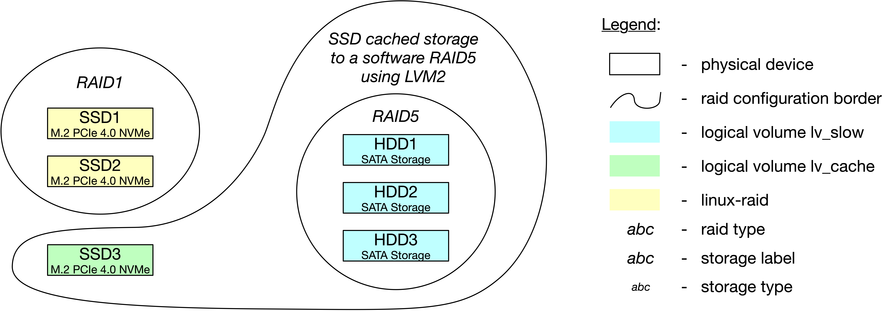

# Welcome to the AI-Lab Repository

This repository supports the standardized node configuration, 
so that Artificial-Intelligence-(AI)-laboratory components work in harmony.

The lab configuration tool was originally developed by Dr.-Ing. Marcus Grum.

This configuration has been tested on `Ubuntu-20.04` (using `ubuntu-20.04-server-amd64.iso`) 
as well as on `Ubuntu22.04` (using `ubuntu-22.04-server-amd64.iso`).

## Prepare your BIOS to detect all storage devices.

If you use `ASUS` workstation motherboard called `Pro WS WRX80E-SAGE SE WIFI`,
you urgently need to realize these

1. Update to most current BIOS version.
   Here, the easiest way is as follows:
   Format an USB stick with `fat32` and

1. Enable `BIOS SR-IOV` to activate single root IO virtualization support.
   You can find it at menu `advanced/PCI subsystem settings/SR-IOV_Support`.
   
1. Enable `BIOS CSM` and enable all sub-features in `UEFI mode` (except `VGA/Graphic`).

1. Test, if you can see all storage devices at BIOS.
   If you can see all storage devices, such as `M2`, `SSDs`, `HDDs`, you are ready to go to install OS.

## Download and install newest Ubuntu

1. Download the recent Ubuntu (server version) from
```https://ubuntu.com/download```

1. Create a bootable USB stick with the help of Etcher. Detailed steps can be found at
```https://ubuntu.com/tutorials/create-a-usb-stick-on-macos#4-install-and-run-etcher```

1. Install Ubuntu and follow Ubuntu installation instructions.
Hence, during the installation process, please consider the following decisions:

	* Computer name follows naming convention `AILabNode02`.

	* OS is installed on SSDs on a `RAID1`. This consumes SSD1 and SSD2. 
	This can not be specified via BIOS before Ubuntu installation.
	This can not be specified via Ubuntu-desktop installation.
	This can not be specified after Ubuntu-desktop installation.
	This only can be specified via Ubuntu-server installation.

	* Data tank is on HDDs on a `RAID5`. This consumes HDD1, HDD2 and HDD3.
	This can not be specified via BIOS before Ubuntu installation.
	This can not be specified via Ubuntu-desktop installation.
	This can either be specified after Ubuntu-desktop installation, or
	this only can be specified via Ubuntu-server installation.

	* A `softraid`on `btfs` is based on SSD3 being the `cache` and Data tank being the `data`.
	So, cached data is backed up at runtime when processing time is available.
	This is specified via OS after Ubuntu installation.

	* `RAID1` is based on three partitions. 
	First, 200MB for `EFI` (or 1.000MB `Bios grub spacer`).
	Second, `EXT4` being mounted at `/`.
	Third, `SWAP` partition having the size of RAM.

	* Use `LVM` with the new Ubuntu installation, so that you easily can deal with partitions, later.
	
	* Install `OpenSSH server`, to enable secure remote access to your server.

	Hence, the raid configuration looks as follows:
	
	
	
	Why are we doing this?
	
	Linux OS is mirrored on ultra-fast M2-SSDs, so that operations can be realized fast.
	Since linux partitions are mirrored as `RAID1`, it is backed up efficiently.
	Hence, one SSD failure can be captured.
	Further, huge storage is provided by HDDs, which are backed up by `RAID5`.
	Ultra-fast M2-SSD3 is considered as cache for huge storage raid, 
	so that reading operations can be realized fast (in case `writethrough`)
	and reading and writing operations can be realized fast (in case `writeback`).
	Since reliability is prioritized, `writethrough` is preferred.
	Here, 
	(1) writing is realized based on HDD speed, 
	(2) reading is realized in SSD speed,
	(3) one SSD failure can be captured because of mirroring relevant data from `RAID1` and
	(4) one HDD failure can be captured because of mirroring data in `RAID1`.
	
1. At Ubuntu server installation, setup partitions according to `https://alexskra.com/blog/ubuntu-20-04-with-software-raid1-and-uefi/`.
Only then, `RAID1` can be setup as required.

   - Reformat both drives if they’re not empty.

   - Mark both drives as a boot device. Doing so will create an ESP(EFI system partition) on both drives.

   - Add an unformatted GPT partition to both drives. They need to have the same size. We’re going to use those partitions for the RAID that contains the OS.

   - Create a software RAID(md) by selecting the two partitions you just created for the OS.

   - Congratulations, you now have a new RAID device. Let’s add at least one GPT partition to it.
     
   - Create a partitions for Ubuntu on the RAID device.
     Faced with our specification from above, we add two partitions: 
     (a) `EXT4` being mounted at `/`.
     (b) `SWAP` partition specified before because we want the ability to swap, create a swap partition on the RAID device. 
     Typically, you will set the size to the same as your RAM, or half if you have 64 GB or more RAM.

1. After installation, update and upgrade your system

	```
	sudo apt-get update
	sudo apt-get upgrade
	sudo apt-get update
	```

1. Install latest ubuntu drivers, which includes `nvidia` driver, for correctly displaying GUI e.g.
For instance, by this, gamma issue (super white filter at standard GUI) vanishes.

	```
	sudo ubuntu-drivers install
	```

1. Install the desktop environment:

	```
	sudo apt install ubuntu-desktop
	``` 

1. Install and set up a display manager to manage users and load up the desktop environment sessions. 
   At installation process, select `GDM3` because it refers to the default display manager of GNOME. 
   Alternatively, you can choose `LightDM`.

	```
	sudo apt install lightdm
	``` 

1. Run this command to start the LightDM service with systemctl:

	```
	sudo systemctl start lightdm.service
	```

1. Run this command to start the LightDM service using the service utility:

	```
	sudo service lightdm start
	```

1. Reboot your system with the reboot

	```
	sudo systemctl reboot -i
	```

1. Login at desktop GUI and test GUI.


## Set up software RAID

After Ubuntu installation, set up the `softraid` specified before.
Detailled steps can be found at `https://ahelpme.com/linux/lvm/ssd-cache-device-to-a-software-raid5-using-lvm2/`.

1. Install `geparted` for dealing with storage in a plug-n-play manner.

1. Use `gparted` to create a partition manually on each `sda`.
Consider `unformated` as file system, here.
Further, set up a partition in the NVME SSD device to occupy only 91% of the space
to have a better SSD endurance and in many cases performance.

1. Install lvm2 and enable the lvm2 service. 
   But first, have a look on the individual storage devices and verify its partitions:

	```
	sudo su
	parted /dev/sda
	(parted) p
	(parted) q
	parted /dev/sdb
	(parted) p
	(parted) q
	parted /dev/sdc
	(parted) p
	(parted) q
	parted /dev/nvme2n1
	(parted) p
	(parted) q
	```

1. Add partitions to the LVM2 (as physical volumes):

	```
	sudo pvcreate /dev/sda1 /dev/sdb1 /dev/sdc1 /dev/nvme2n1p1
	```

1. Create the LVM Volume Group device. The four physical volumes must be in the same group.

	```
	sudo vgcreate VG_storage /dev/sda1 /dev/sdb1 /dev/sdc1 /dev/nvme2n1p1
	```

1. Create the RAID5 device using the three slow hard drive disks and their partitions 
`/dev/sda1`, `/dev/sdb1` and `/dev/sdc1`. 
We want to use all the available space on our slow disks in one logical storage device we use `100%FREE`. 
The name of the logical device is `lv_slow` hinting it consists of slow disks.

	```
	sudo lvcreate --type raid5 -I 512 -l 100%FREE -n lv_slow VG_storage /dev/sda1 /dev/sdb1 /dev/sdc1
	```

1. Create the cache pool logical volume with the name `lv_cache` (to show it’s a fast SSD device). 
Again, we use 100% available space on the physical volume (100% from the partition we’ve used).

	```
	lvcreate --type cache-pool -l 100%FREE -c 4M --cachemode writethrough -n lv_cache VG_storage /dev/nvme2n1p1
	```

	Consider `writeback` if you focus on performance. 
	This mode delays writing data blocks from the cache back to the origin LV. 
	But this mode will increase performance, but the loss of a cache device can result in lost data. 
	Hence, this mode should only be used if the fast cache is realized as individual `RAID1`.

	Consider `writethrough` instead if you focus on security.
	This mode ensures that any data written will be stored both in the cache and on the origin LV. 
	The loss of a device associated with the cache in this case would not mean the loss of any data.

1. Convert the cache device – the slow device (logical volume `lv_slow`) 
will have a cache device (logical volume `lv_cache`):

	```
	lvconvert --type cache --cachemode writethrough --cachepool VG_storage/lv_cache VG_storage/lv_slow
	```

1. Format and do not miss to include it in the /etc/fstab to mount it automatically on boot.

	```
	mkfs.ext4 /dev/VG_storage/lv_slow
	```

1. Get to know `UUID` of `lv_slow` by

	```
	blkid |grep lv_slow
	```

1. Add `UUID` of `lv_slow` to the `/etc/fstab`, so that it is mounted automatically on boot.
E.g., the entry looks like this:

	```
	UUID=cbf0e33c-8b89-4b7b-b7dd-1a9429db3987 /mnt/storage ext4 defaults,discard,noatime 1 3
	```

1. You are ready to use this cached `RAID1` by mounting it:

	```
	/mnt/storage
	```

## Set-Up Ubuntu AILab configuration

### Install NVIDIA driver

1. Select most current NVIDIA driver from Ubuntu setting menu.

1. Test nvlink of graphic card `0`:

	```
	nvidia-smi nvlink --status -i 0
	```

1. Test nvlink capabilities of graphic card `0`:

	```
	nvidia-smi nvlink --capabilities -i 0
	```

1. Activate `SLI` modus: 

	TBD?

### Install further tools

1. Install net-tools, so that you e.g. can run `ifconfig` to get to know your current IP address.

	```
	sudo apt install net-tools
	```

1. Install CLI gpu monitor:

	```
	sudo apt install nvtop
	```
	
	Test this monitoring tool by running it:
	
	```
	nvtop
	```
	
1. Install Internet browser called `firefox`:
	
	```
	sudo apt install firefox
	```
	
	Why don't you install `Tree Style Tab` add-on manually right now?
	
1. Install usefull libraries, such as numpy, matplotlib, etc.

	```
	pip3 install numpy
	pip3 install matplotlib
	```

1. Install visual studio code as open-source editor:

	Update package entries to install the editor first.

	```
	sudo apt-get install wget gpg
	wget -qO- https://packages.microsoft.com/keys/microsoft.asc | gpg --dearmor > packages.microsoft.gpg
	sudo install -D -o root -g root -m 644 packages.microsoft.gpg /etc/apt/keyrings/packages.microsoft.gpg
	sudo sh -c 'echo "deb [arch=amd64,arm64,armhf signed-by=/etc/apt/keyrings/packages.microsoft.gpg] https://packages.microsoft.com/repos/code stable main" > /etc/apt/sources.list.d/vscode.list'
	rm -f packages.microsoft.gpg
	```

	Then, install the editor.
	
	```
	sudo apt install apt-transport-https
	sudo apt update
	sudo apt install code
	```

### Install docker engine

The docker engine suits to deal with programs over-the-air.
Detailed installation steps can be found at https://docs.docker.com/engine/install/ubuntu.

#### a) Set up the package index to install docker

Before you install Docker Engine for the first time on a new host machine, you need to set up the Docker repository. Afterward, you can install and update Docker from the repository.

1. Update the apt package index and install packages to allow apt to use a repository over HTTPS:

	```
	sudo apt-get update
	
	sudo apt-get install \
		ca-certificates \
		curl \
		gnupg \
		lsb-release
	```

1. Add Docker’s official GPG key:

	```
	sudo mkdir -p /etc/apt/keyrings
	
 	curl -fsSL https://download.docker.com/linux/ubuntu/gpg | sudo gpg --dearmor -o /etc/apt/keyrings/docker.gpg
	```

1. Use the following command to set up the repository:

	```
	echo \
		"deb [arch=$(dpkg --print-architecture) signed-by=/etc/apt/keyrings/docker.gpg] https://download.docker.com/linux/ubuntu \
		$(lsb_release -cs) stable" | sudo tee /etc/apt/sources.list.d/docker.list > /dev/null
	```

#### b) Install Docker Engine

1. Update the apt package index, and install the latest version of Docker Engine, containerd, and Docker Compose, or go to the next step to install a specific version:

	```
	sudo apt-get update
	
	sudo apt-get install docker-ce docker-ce-cli containerd.io docker-compose-plugin
	```

1. Test docker engine installation:

	```
	sudo docker run hello-world
	```

1. Install docker-compose:

	```
	sudo apt install docker-compose
	```

1. Test docker-compose by showing its current version:

	```
	docker-compose --version
	```

#### c) Move docker's `data-root` to huge data storage

If you intend to deal with docker volumes and expect huge data (that exceeds  SSD memory), 
move docker data directory and you won’t risk any more to run out of space in your root partition.
Be aware, that this slows operation about a factor of 4.0!

1. Stop the docker daemon:

	```
	sudo service docker stop
	```

1. Add a configuration file to tell the docker daemon what is the location of the data directory.
Using your preferred text editor, add a file named `daemon.json` under the directory `/etc/docker`. 
The file should have at least this content:

	```
	{
  	   "data-root": "/mnt/storage/docker-data-root"
	}
	```

1. Copy the current data directory to the new one

	```
	sudo rsync -aP /var/lib/docker/ /mnt/storage/docker-data-root
	```

1. Rename the old docker directory

	```
	sudo mv /var/lib/docker /var/lib/docker.old
	```
	
	This is just a sanity check to see that everything is ok and docker daemon will effectively use the new location for its data.

1. Create a symbolic link from old docker directory `/var/lib/docker` to new docker directory `/mnt/storage/docker-data-root`.
So, old containers having `/var/lib/docker` paths configured in them can be restarted
and everything works as before moving docker's `data-root` path.

	```
	sudo ln -s /mnt/storage/docker-data-root /var/lib/docker
	```

	Note, the destination folder comes as the first argument to the `ln`command.

1. Restart the docker daemon

	```
	sudo service docker start
	```

1. Test

	If everything is ok you should see no differences in using your docker containers. 
	When you are sure that the new directory is being used correctly by docker daemon you can delete the old data directory.

	```
	sudo rm -rf /var/lib/docker.old
	```

### Setting up NVIDIA Container Toolkit

Setting up NVIDIA Container Toolkit so that it functions as driver for docking docker containers to GPUs.
Detailed steps can be found at https://docs.nvidia.com/datacenter/cloud-native/container-toolkit/install-guide.html#docker.

1. Setup the package repository and the GPG key:

	```
	distribution=$(. /etc/os-release;echo $ID$VERSION_ID) \
		&& curl -fsSL https://nvidia.github.io/libnvidia-container/gpgkey | sudo gpg --dearmor -o /usr/share/keyrings/nvidia-container-toolkit-keyring.gpg \
		&& curl -s -L https://nvidia.github.io/libnvidia-container/$distribution/libnvidia-container.list | \
			sed 's#deb https://#deb [signed-by=/usr/share/keyrings/nvidia-container-toolkit-keyring.gpg] https://#g' | \
			sudo tee /etc/apt/sources.list.d/nvidia-container-toolkit.list
	```

1. Install the nvidia-docker2 package (and dependencies) after updating the package listing:

	```
	sudo apt-get update
	
	sudo apt-get install -y nvidia-docker2
	```

1. Restart the Docker daemon to complete the installation after setting the default runtime:
	
	```
	sudo systemctl restart docker
	```

	At this point, a working setup can be tested by running a base CUDA container:
	
	```
	sudo docker run --rm --gpus all nvidia/cuda:11.0.3-base-ubuntu20.04 nvidia-smi
	```
	
	This should result in a console output shown below:
	
	```
	+-----------------------------------------------------------------------------+
	| NVIDIA-SMI 515.48.07    Driver Version: 515.48.07    CUDA Version: 11.7     |
	|-------------------------------+----------------------+----------------------+
	| GPU  Name        Persistence-M| Bus-Id        Disp.A | Volatile Uncorr. ECC |
	| Fan  Temp  Perf  Pwr:Usage/Cap|         Memory-Usage | GPU-Util  Compute M. |
	|                               |                      |               MIG M. |
	|===============================+======================+======================|
	|   0  NVIDIA RTX A6000    Off  | 00000000:30:00.0 Off |                  Off |
	| 30%   49C    P8    20W / 300W |      5MiB / 49140MiB |      0%      Default |
	|                               |                      |                  N/A |
	+-------------------------------+----------------------+----------------------+
	|   1  NVIDIA RTX A6000    Off  | 00000000:41:00.0  On |                  Off |
	| 30%   59C    P8    30W / 300W |    299MiB / 49140MiB |      1%      Default |
	|                               |                      |                  N/A |
	+-------------------------------+----------------------+----------------------+
	                                                                               
	+-----------------------------------------------------------------------------+
	| Processes:                                                                  |
	|  GPU   GI   CI        PID   Type   Process name                  GPU Memory |
	|        ID   ID                                                   Usage      |
	|=============================================================================|
	+-----------------------------------------------------------------------------+
	```

### Install git tools

Git tools suite for dealing with different kinds of repositories.

1. Install git (detailed steps can be found at https://github.com/git-guides/install-git)

	```
	sudo apt-get update

	sudo apt-get install git-all
	```

1. Test git installation by showing current git version:

	```
	git --version
	```

### Install AILab repositories

1. Prepare joint repository at cached `RAID5` storage created before:

	```
	mkdir /mnt/storage/repositories
	
	cd /mnt/storage/repositories
	```

1. Clone relevant repositories, such as the following:

	```
	git clone https://github.com/MarcusGrum/AI-CPS.git
	```